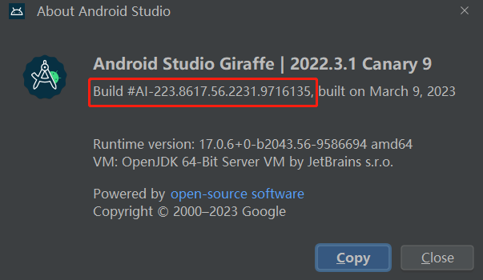
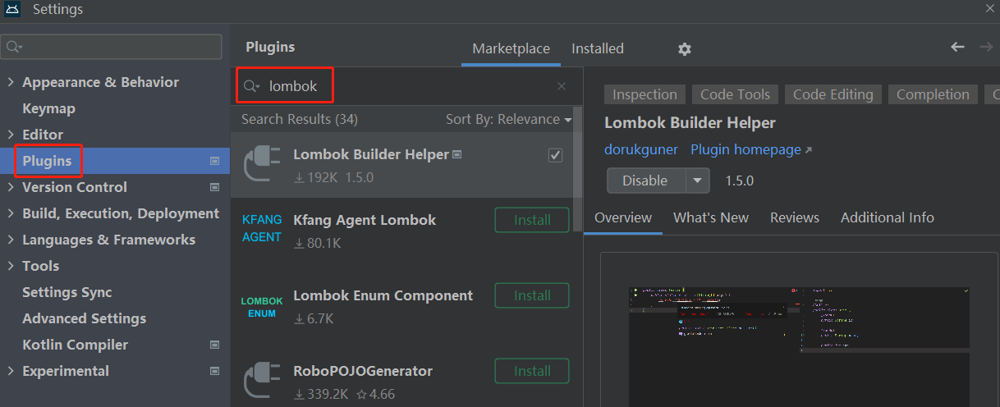
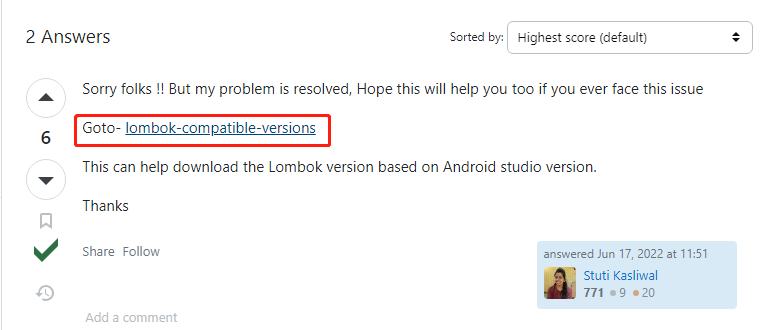
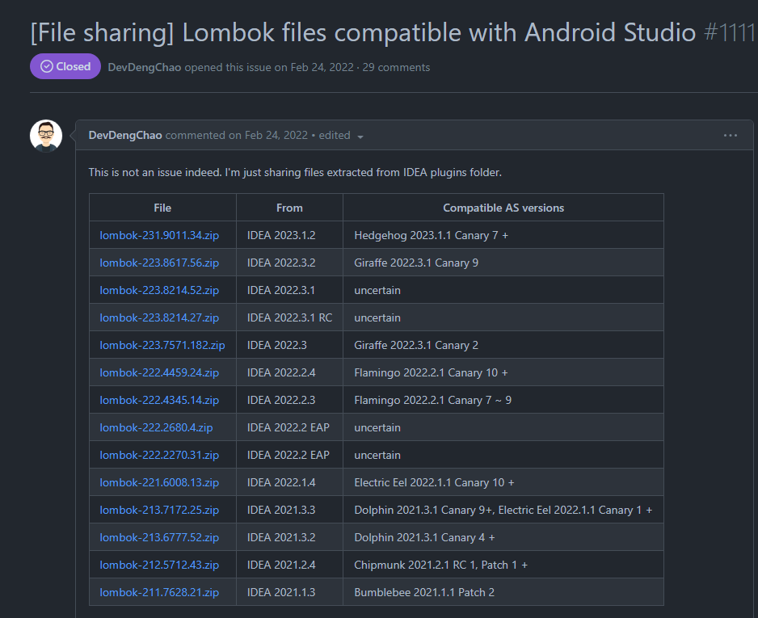
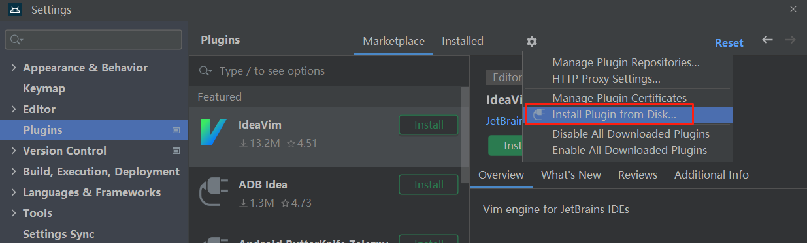
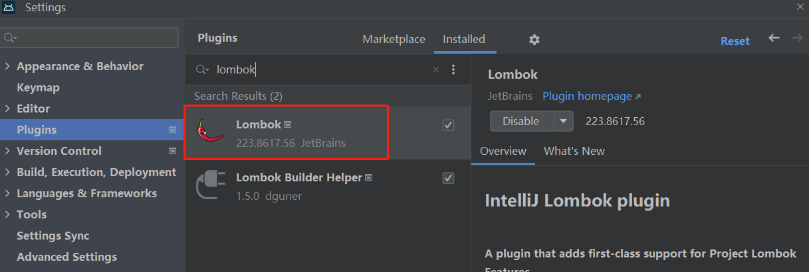

另一篇中说了使用了代码混淆导致**EvalEx**扩展包失效, 其实在此之前, 还有一个问题, 那就是缺少了 **lombok** 库

不过该问题也比较有趣, 在debug的情况下打包生成app, 是不会触发错误提示缺少 **lombok** 库的, 一切都正常运行

在进行`release`打包的时候才会触发错误提示,但是在我写这篇文章时, 该问题已被解决, 具体错误描述没法放上来了


<!--more-->


先看看ChatGPT是怎么介绍 **lombok** 的

> Lombok是一个Java库，它可以通过注解来简化Java类的开发，并减少样板代码（boilerplate code）的编写。Lombok的目标是让Java开发者能够更加高效地编写简洁的代码，同时减少冗长的getter和setter方法、构造函数以及其他常见的样板代码。
>
> 使用Lombok，你可以在Java类中添加一些注解，以自动生成常见的代码块，例如：
>
> 1. `@Getter`和`@Setter`：自动生成字段的getter和setter方法。
> 2. `@ToString`：自动生成`toString()`方法。
> 3. `@EqualsAndHashCode`：自动生成`equals()`和`hashCode()`方法。
> 4. `@NoArgsConstructor`：自动生成无参构造函数。
> 5. `@RequiredArgsConstructor`：自动生成包含必填字段的构造函数。
> 6. `@AllArgsConstructor`：自动生成包含所有字段的构造函数。
> 7. `@Data`：生成所有常见方法，如getter、setter、equals、hashCode等。
> 8. `@Builder`：用于构建器模式，自动生成建造对象的方法。
>
> 通过使用Lombok，开发者可以更专注于业务逻辑而不是编写重复的模板代码，从而提高代码的可读性和维护性。
>
> 要使用Lombok，你需要在项目中添加Lombok的依赖，并在你的Java类中引入Lombok的注解。然后，编译器会在编译时自动生成相关的代码。请注意，虽然Lombok可以提高开发效率，但它也可能会导致一些潜在的问题，因此在使用之前需要仔细了解其工作原理和限制。


经过上面的解释可以得知**lombok**是什么之后, 就要为**EvalEx**补上这个库了, 在翻找了一圈之后

找到了该库的

**github**地址: https://github.com/projectlombok/lombok

官方地址: https://projectlombok.org/all-versions

顺便补上**EvalEx的github**地址 : https://github.com/ezylang/EvalEx


因为我的Android studio 版本在**Plugins**里面搜是没有这个扩展可安装的, 只能手动安装






所以另外找到了两个如何安装**lombok**的方法

方法一: https://www.xjx100.cn/news/193686.html?action=onClick

方法二: https://zhuanlan.zhihu.com/p/597777983?utm_id=0

Lombok插件网站（jetbrains.com) : https://plugins.jetbrains.com/plugin/6317-lombok/versions


但是这上面2个方法呢, 因为版本的关系 比较麻烦, 要把压缩包改来改去, 没有直接能使用的

我就去**stackoverflow**上找了找 确实找到了一个有用的回答

https://stackoverflow.com/questions/72658652/plugin-lombok-is-not-compatible-with-current-version-of-ide-because-it-requires




给出了一个链接, 里面有 **Lombok插件网站（jetbrains.com)** 所没有的版本

Goto- [lombok-compatible-versions](https://github.com/mplushnikov/lombok-intellij-plugin/issues/1111)




找到对应版本, 直接下载好压缩包之后, 在 Android studio 的 Plugins 里面 点击从磁盘里找到刚刚下载好的压缩包, 选择安装即可




完成安装




另外ChatGPT给我的建议是, 在项目目录下新建一个**lombok.config**文件, 并加入如下代码

以此来用来控制是否在 Lombok 生成的代码中添加 `@javax.annotation.Generated` 注解

```
lombok.addLombokGeneratedAnnotation = true
```