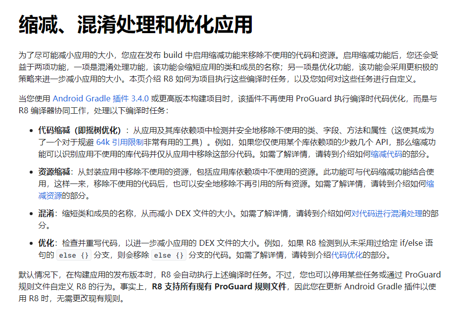
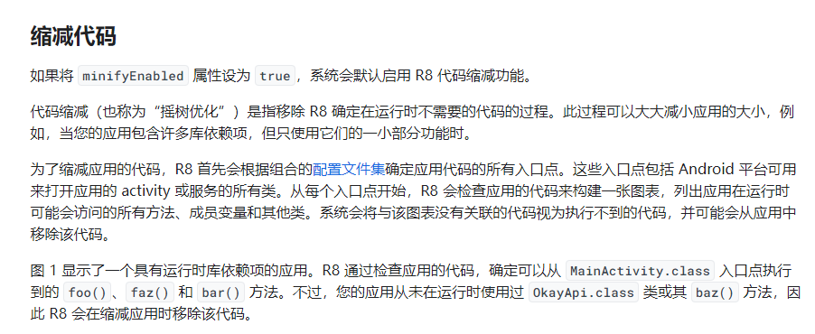
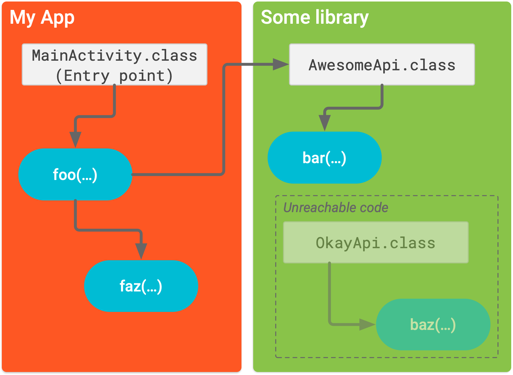
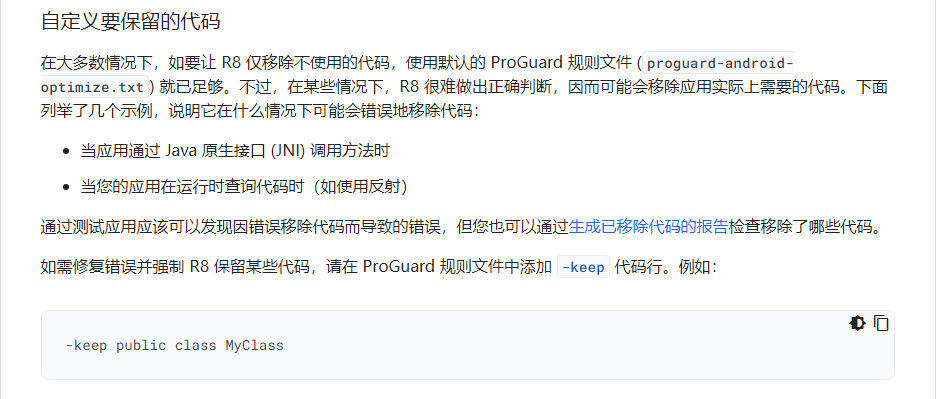

最近开发了一个支持简单四则运算的计算器, 其中使用到了 `com.ezylang:EvalEx` 扩展包, 

用于支持基本数学运算符的数学表达式, 开发阶段正常使用没有问题

然而当我开发完成打包签名时, 进行计算时就会出现错误


<!--more-->

> Operatorannotation for com.ezylang.evalex.operators.arithmetic PrefixPlusOperator’not found


大概就是说找不到`com.ezylang.evalex`里面的某个类, 然而, 我很确定的是在我开发阶段是没有任何问题的

经过对比, 确认是在`release` 配置中启用了代码混淆的问题, 先来看看官方对代码混淆的解释 👉 [官方地址](https://developer.android.google.cn/studio/build/shrink-code?hl=zh-cn#enable)




可以看出, R8只做了3件事

- 代码/资源缩减
- 混淆
- 优化

其中, 我们重点关注**代码缩减**这个步骤






有意思的是, 后面还有一段说明, 表示: **在某些情况下，R8 很难做出正确判断，因而可能会移除应用实际上需要的代码**




那么问题就很清晰了, 大概率是R8在做代码缩减时, 把 `com.ezylang:EvalEx`扩展包里我需要用到的东西当成无用代码给删掉了

so 👇 我们此时只需要在 `proguard-rules.pro` 文件, 加上一行, 表示保留`com.ezylang.evalex`包下的全部代码

> -keep class com.ezylang.evalex.** { *; }


再次编译代码后, 四则运算计算器顺利执行


其实问题并不难, 但是若一开始被报错的内容所迷惑, 无从得知是R8的代码混淆造成的问题, 排查方向错了, 

错误地把矛头指向`com.ezylang.evalex`, 可能在debug的路上越走越远, 最终放弃使用`com.ezylang.evalex`。 人生亦是如此🍺


PS: 补上 `build.gradle.kts`文件, 在`buildTypes` 中开启代码混淆配置, 完美收官💻

```
    buildTypes {
        release {
            isMinifyEnabled = true // 启用代码混淆
//            isShrinkResources = true // 启用资源缩减

            proguardFiles(
                getDefaultProguardFile("proguard-android-optimize.txt"),
                "proguard-rules.pro"
            )
            signingConfig = signingConfigs.getByName("release")
        }
        debug {
            isMinifyEnabled = false // 不启用代码混淆
//            isShrinkResources = true // 启用资源缩减
            proguardFiles(
                getDefaultProguardFile("proguard-android-optimize.txt"),
                "proguard-rules.pro"
            )
            signingConfig = signingConfigs.getByName("debug")
        }

    }
    
    signingConfigs {
        create("release") {
            keyAlias = "key0"
            keyPassword = "pwd"
            storeFile = file("D:\\Android\\Projects\\pwd.jks")
            storePassword = "pwd"
        }
    }
    
```


