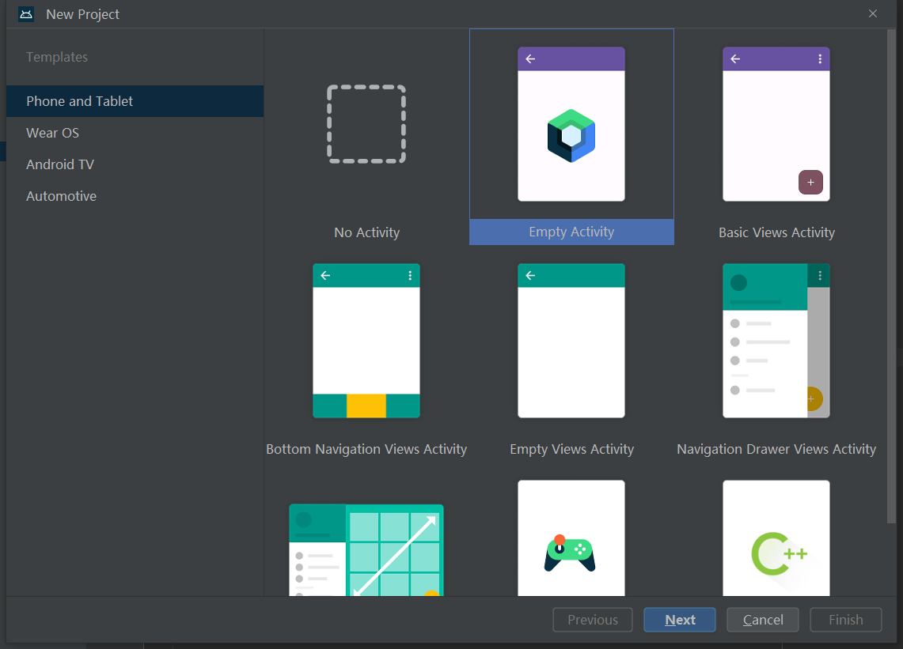
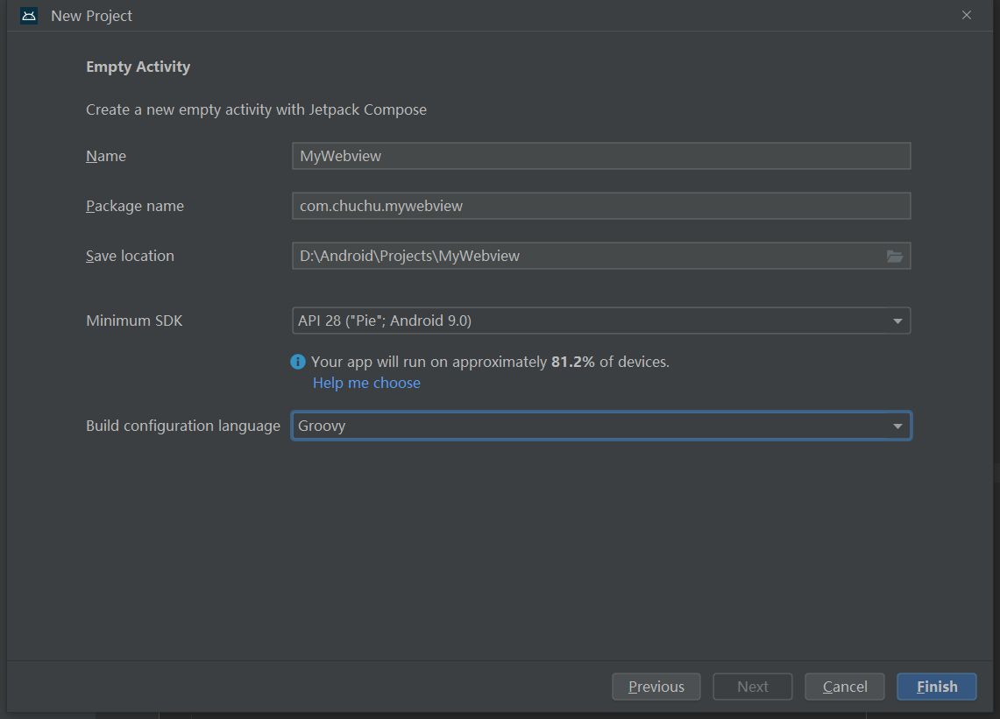
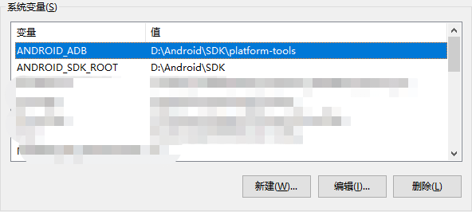
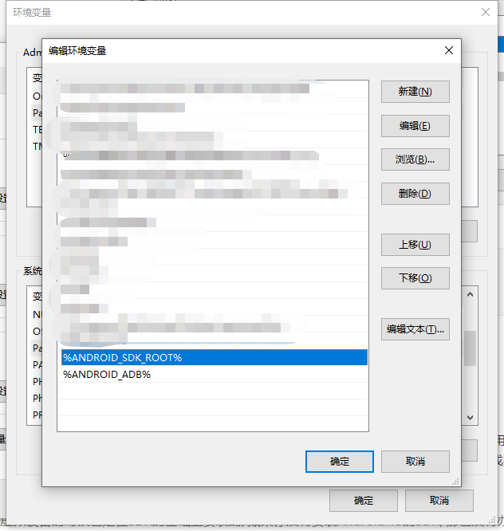
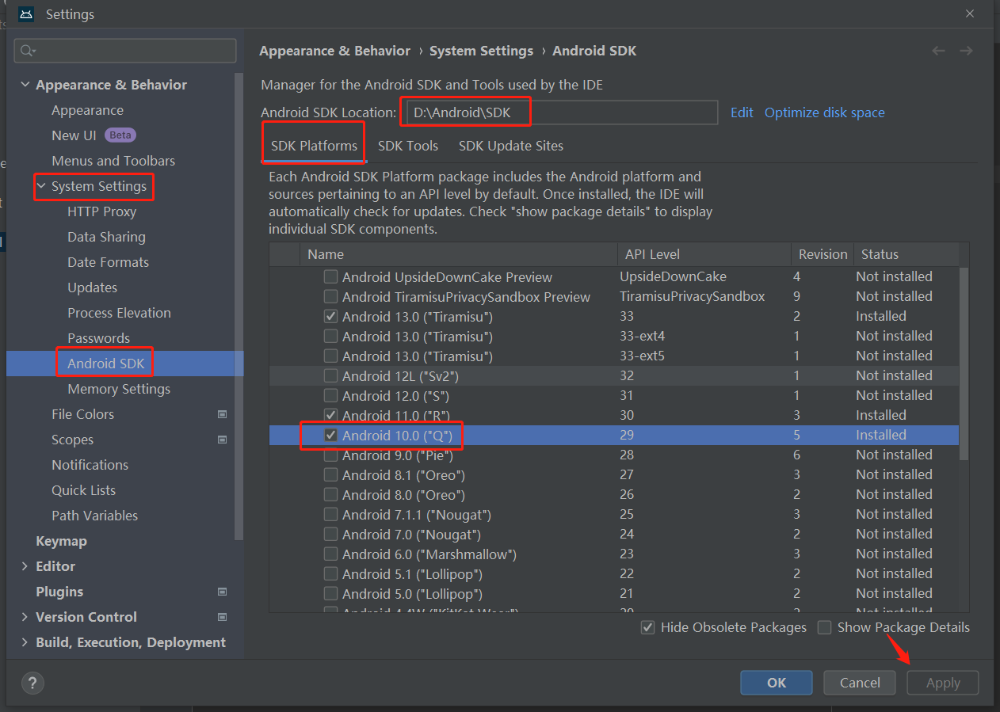
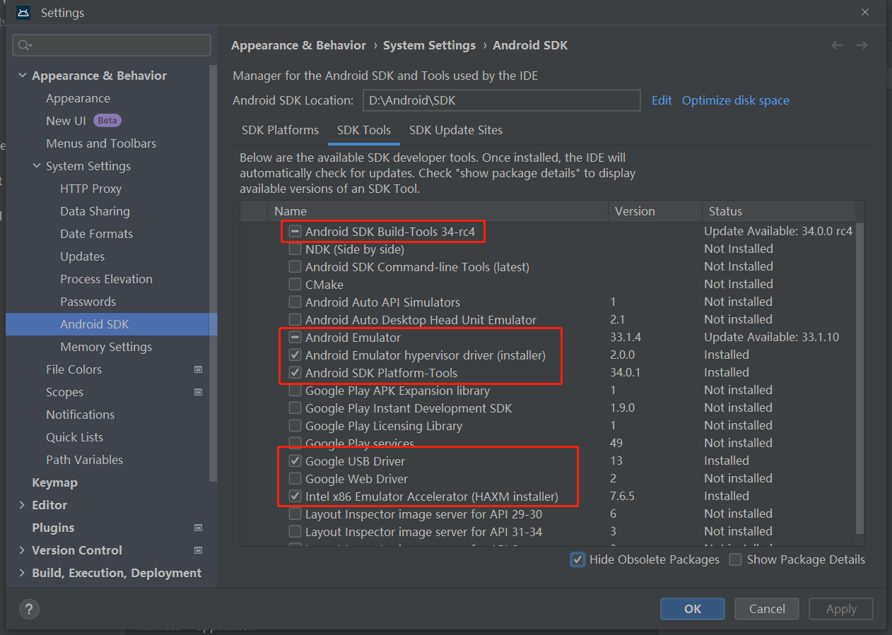
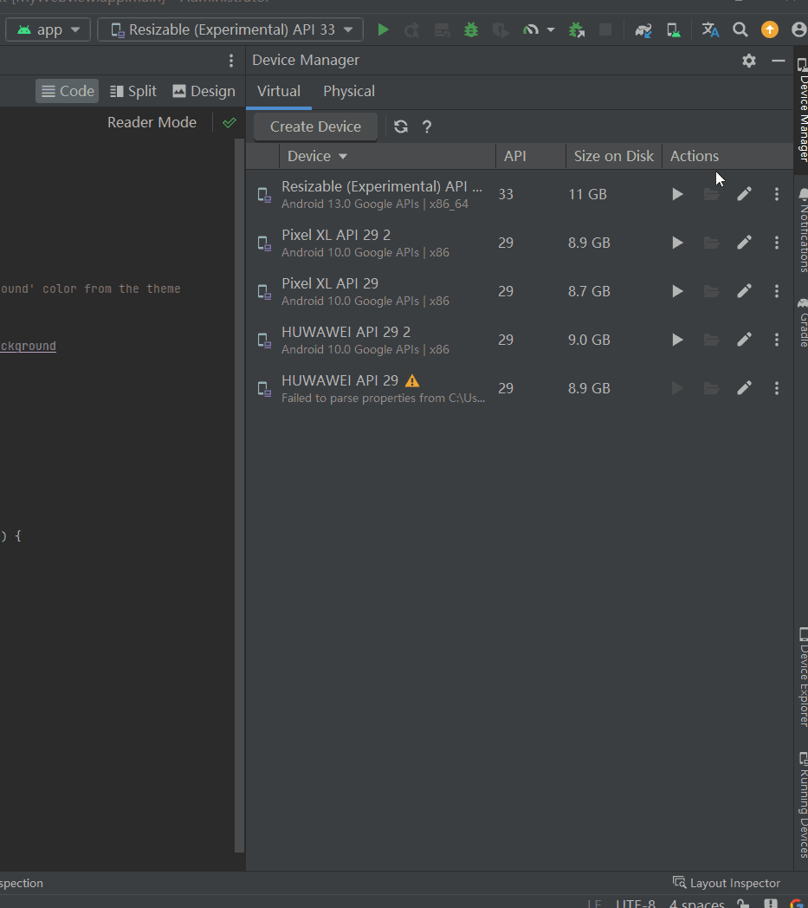

# [教程] Android Webview 开发(App内嵌web) 


> 自己花了2周的时间慢慢摸索出来的一点点经验, 网上教程很多, 但更多的是搬运或者年份比较久远的了, 借着着ChatGPT和网上的方法总算把项目搞定了, 打算把从开发到上架Google Play的全流程记录下来方便回顾总结, 同时希望对大家有一点点帮助。
>
> <!--more-->
>
> 另外安装 Android studio 教程就不出了, 实在是不想卸载了重新安装一遍, 需要安装教程的伙伴们可以参考知乎这位大佬写的教程 [全网最全最细Android Studio 安装和使用教程](https://zhuanlan.zhihu.com/p/528196912) , 不过这个教程的第三步, <SDK的安装> 建议跳过, 直接看第四步 <Android模拟器的下载> , 因为现在新版本 Android studio 里面已经集成SDK安装了, 不需要去单独下载, 可能是这位大佬当时是旧版本还没有集成到。


## 一. 创建项目

选择 `Empty Activity`




### 1. Package name

Package name 尽量不要使用默认的  `com.example` 开头, 起个正经点的名字, 特别是如果后续想要打包发布到 `google paly` 上面的, `com.example` 开头是不会通过的, 到时候还得代码里各种改一遍包名, 然后还可能会有莫名其妙的缓存问题因为包名改了导致各种报错, 算是一个小小的坑, 尽量一开始定好就不要改动。


### 2. Minimum SDK

关于SDK的选择, 尽量选择稍微低版本的SDK, 这样能支持的设备就更多一些, 如果是个人项目练习的可以随意, 如果公司项目的话尽量选择能支持多设备的, 一般能支持95%以上差不多可以了, 具体看公司要求, 本人这里选择的是API 28。


### 3. Build language

构建语言选择, Kotlin 是 Android 开发的推荐语言，它提供了现代化的语言特性、更好的性能和良好的工具支持。而 Groovy 在 Android 开发中的使用相对较少，主要适用于特定场景或个人喜好。选择哪种语言取决于个人偏好、项目需求和团队情况 。本人推荐选择`Kotlin`, 选择完点击 `Finish` ,会自动进行项目初始化,耐心等待一会就好了 。




## 二. 目录结构及重要文件

初始化好后, 可以点击左上角切换项目以什么形式展开, `Project`形式能更详细看到每个文件和目录,  `Android`形式会简化很多不必要的文件夹,看起来更加简洁舒适 。目录结构介绍较长, 着急下一步安装的可以直接跳到第三步 [SDK安装](#sdk) ,  后续再回来看结构介绍。


WebView 项目通常遵循以下目录结构：

```prel
- app/
  |- src/
  |  |- main/
  |     |- java/
  |     |  |- com.example.app/           	# 应用的代码
  |     |  |  |- MainActivity.java       	# 主Activity文件
  |     |
  |     |- res/
  |     |  |- layout/                    	# 布局文件
  |     |  |  |- activity_main.xml
  |     |  |
  |     |  |- values/                    	# 值资源文件
  |     |  |  |- strings.xml			 	# 字符串资源文件
  |     |
  |     |- AndroidManifest.xml   			# 应用程序清单文件
  |
  |     |- assets/                        	# WebView使用的本地资源
  |     |  |- index.html                  	# WebView入口HTML文件
  |     |  |- css/                        	# CSS样式文件
  |     |  |- js/                         	# JavaScript脚本文件
  |     |  |- images/                     	# 图片文件
  |     |- ...
  |- build.gradle.kts                     	# 项目的Gradle构建配置文件
  |- ...
```


### 1. com.example.app

我们一般情况主要开发都是在`com.example.app`下面进行的, 主要代码基本都在这里, 这里说明一下, 如果是新版本的`Android studio`初始化的时候, 默认是使用`Kotlin` 语言进行开发的,  所以主Activity文件会是 `MainActivity.kt`而不是 `MainActivity.java`,  不管是`Kotlin`还是`Java`, 选择哪个作为应用的开发语言都可以的,  而且这两个语言是可以相互转换的, 用`Java`的话可以删掉`MainActivity.kt`, 自己新建  `MainActivity.java`。


> Kotlin 是一种现代的、静态类型的编程语言，与 Java 语言可以在 Android 开发中无缝集成。它提供了更简洁、安全、表达力强的语法，并具有许多特性和功能，可帮助开发者更高效地编写 Android 应用程序。


### 2. AndroidManifest.xml

<span style="color: #bf1d2c;">**重要: `AndroidManifest.xml` 是 Android 应用程序的 核心配置文件，它描述了应用程序的基本信息、组件、权限和行为等。在开发 Android 应用程序时，清单文件的正确配置和使用非常重要，它直接影响应用程序的功能和行为。**</span>

```xml
<?xml version="1.0" encoding="utf-8"?>
<manifest xmlns:android="http://schemas.android.com/apk/res/android"
    xmlns:tools="http://schemas.android.com/tools">
    
    <!-- 权限声明：通过 <uses-permission> 元素，你可以声明应用程序需要的权限。Android 操作系统会在安装应用程序时向用户展示所请求的权限，并在用户同意后授予应用程序相应的权限。 -->
    <uses-permission android:name="android.permission.INTERNET" />
    <uses-permission android:name="android.permission.ACCESS_NETWORK_STATE" />
    <uses-permission android:name="android.permission.ACCESS_WIFI_STATE" />
    
    <!-- <application> 元素用于定义应用程序的全局配置和属性 -->
    <application
        android:allowBackup="true"
        android:dataExtractionRules="@xml/data_extraction_rules"
        android:fullBackupContent="@xml/backup_rules"
        android:icon="@mipmap/ic_launcher"
        android:label="@string/app_name"
        android:roundIcon="@mipmap/ic_launcher_round"
        android:supportsRtl="true"
        android:theme="@style/Theme.MyWebview"
        tools:targetApi="31">
        
        <!-- <activity> 元素用于声明应用程序的活动（Activity）。每个活动都需要在清单文件中进行声明，以便在应用程序中使用
android:name: 指定活动的类名(默认MainActivity.java)
android:theme：指定活动的主题样式
-->
        <activity
            android:name=".MainActivity"
            android:exported="true"
            android:label="@string/app_name"
            android:theme="@style/Theme.MyWebview">
            
            <!--  用于指定一个活动（Activity）作为应用程序打开时的主要入口点, 不可有多个, 多个的话安装app时桌面会出现多个应用图标  -->
            <intent-filter>
                <action android:name="android.intent.action.MAIN" />
                <category android:name="android.intent.category.LAUNCHER" />
            </intent-filter>
            
        </activity>
        
    </application>

</manifest>
```


###  3. res/ 目录

在 Android 项目中的 `res/` 目录是用于存放资源文件的目录，其中包含了应用程序所需的各种资源，如布局文件、字符串、图像、颜色、样式等。这个目录是在 Android 项目创建时自动生成的，用于组织和管理应用程序的静态资源，在这些目录中，我们可以根据资源的类型和用途将相应的文件放置在相应的目录中，以便在代码中引用和使用这些资源。

`res/` 目录通常包含以下子目录：

```
- res/
  |- layout/ 		# 用于存放布局文件，定义了应用程序的用户界面的组件和布局结构。
  |- drawable/		# 用于存放图像资源文件，如位图文件（.png、.jpg、.gif 等）或矢量图形文件（.xml）。
  |- mipmap/		# 用于存放应用程序图标的不同分辨率版本。通常包括 `mdpi`、`hdpi`、`xhdpi`、`xxhdpi`、`xxxhdpi` 等不同密度的图标文件。
  |- values/		# 用于存放资源值文件，如字符串、颜色、尺寸、样式等。包括 `strings.xml`、`colors.xml`、`dimens.xml`、`styles.xml`。
  |- raw/			# 用于存放原始资源文件，如音频文件、视频文件、字体文件等。这些文件可以直接通过资源 ID 访问。
  |- menu/			# 用于存放菜单资源文件，定义应用程序的菜单结构。
  |- xml/			# 用于存放其他 XML 文件，如自定义视图、插件配置文件等。
```


### 4. build.gradle

`build.gradle.kts` 是使用 Kotlin 脚本语言编写的 Android 项目的构建脚本文件，用于配置和管理项目的构建过程。如果一开始创建项目时选的是Groovy, 那么生成的就是 `build.gradle` 文件，两者相比, `build.gradle.kts` 提供了使用 Kotlin 语言进行更灵活、类型安全和可编程的构建配置。

在 `build.gradle.kts` 文件中，我们可以定义项目的依赖关系、插件应用、构建类型、任务配置等。


`build.gradle.kts` 文件的基本结构：

```kotlin
// 构建脚本的基本信息和配置
plugins {
    id("com.android.application") version "7.0.0"
    // 其他插件的应用
}

android {
    // Android 构建的配置
    compileSdk = 33 //应用程序的编译目标版本
    defaultConfig {
        applicationId = "com.example.myapp"
        minSdk = 28   //最低支持的 Android 版本
        targetSdk = 33 //目标设备的 Android 版本
        versionCode = 1
        versionName = "1.0"
    }
    // 其他 Android 构建配置
}

dependencies {
    // 依赖关系配置
    implementation("com.android.support:appcompat-v7:28.0.0")
    // 其他依赖项
}

// 自定义任务配置
tasks { 
    // 自定义任务的配置
    val myTask by registering {
        // 任务的配置
    }
    // 其他任务配置
}

```


## <a name="sdk" style="color: inherit;">三. SDK安装</a>

### 1. SDK目录

在 Android 开发中，SDK Platforms 是用于开发和构建 Android 应用程序所需的 Android 平台版本。安装 SDK Platforms 是为了能够编译和运行应用程序的目标 Android 版本。例如，如果你开发的应用程序目标版本是 Android 10（API 级别 29），你应该选择安装对应的 Android 10 SDK Platforms。

 建议目录结构如下, 管理起来方便一些:

```
- d/
  |- Android/
      |- Projects	# 项目目录,所有开发的项目可以放到此目录下
      |- SDK		# SDK目录
      |- Studio		# Android Studio 安装目录
```


### 2. 环境变量配置

点击`我的电脑` -> 属性 -> 高级系统设置 -> 环境变量 -> 新建系统变量

```
创建2个系统变量
ANDROID_SDK_ROOT 	=>  D:\Android\SDK
ANDROID_ADB 		=>  D:\Android\SDK\platform-tools
```





```
把刚创建的系统变量添加到Path变量中
%ANDROID_SDK_ROOT%
%ANDROID_ADB%
```




### 3. SDK安装

点击左上角的 File -> Settings -> System Settings -> Android SDK, 安装目录可以像我这样,  如果我们的应用要在Android 10 运行就找到 Android 10 勾选上, 如果你的应用还要在其他Android版本上运行, 也可以把其他版本安装一下, 选完后点击`Apply` 耐心等待安装完成即可。


> 注意: 后面安装虚拟设备的时候也是在SDK的基础上安装的
>
> 举例: 如果你没有安装Android 13的SDK, 那也没有办法安装和使用Android 13的虚拟设备, 另外安装虚拟设备时有的可能还需要用到 Google APIs 镜像的, 可以点击右下角的 Show Package Details 查看, 根据虚拟设备所需要的Google APIs 来勾选安装。




### 4. SDK Tools 安装

1. Android SDK Build-Tools：构建和编译Android应用程序所必需的工具集，包括编译器、调试器和其他构建工具。
2. Android SDK Platform-Tools：这是与Android设备通信、调试和管理的一组工具，如adb（Android Debug Bridge）、fastboot等。
3. Android Emulator：模拟Android设备的工具，用于在开发计算机上运行和测试Android应用程序。
4. Android Emulator Hypervisor Driver 和 Intelx6 Emulator Accelerator(HAXM installer) 都是加速 Android 模拟器用于提高 Android 模拟器性能的组件。
5. 其他的非必选 各位实际项目需求来, 另外可能Android Studio版本不同, 下图的工具名称可能也有所不同甚至没有这个工具换成其他的替代了。




## 四. 虚拟设备安装

### 1. 选择安装镜像

点击右上角的 `Device Manager`(手机机器人图标)  -> Create Device (创建设备) , 在 `phone` 这一栏选择一个符合你要求的, 然后点击 `NEXT` 进入到具体得镜像选择,

选择好后继续点`NEXT`后再点击`Finish`等待安装完成就可以了

前面安装SDK时说过, 创建虚拟设备跟我们安装的SDK还有镜像有关, 在这里选择镜像的时候有的选项就会置灰不可选择, 因为你没有安装该虚拟设备所需要的Android SDK版本或者 镜像 


### 2. 启动虚拟设备

安装好之后, 如下图, 点击 `Actions` 即可启动虚拟设备




## 五. 启动项目

经过前面的铺垫, 现在终于可以进入开发阶段了, 如果前面一切顺利的话, 现在只需要点击一下右上角的`Run app` , 项目就会运行起来, 然后就可以在虚拟设备的界面上看到`Hello Android!`


