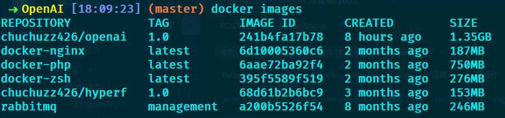
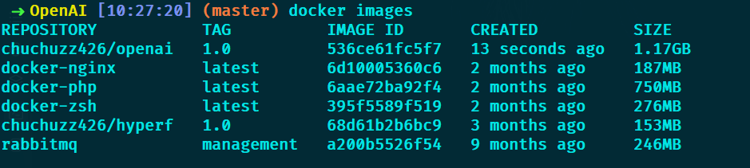
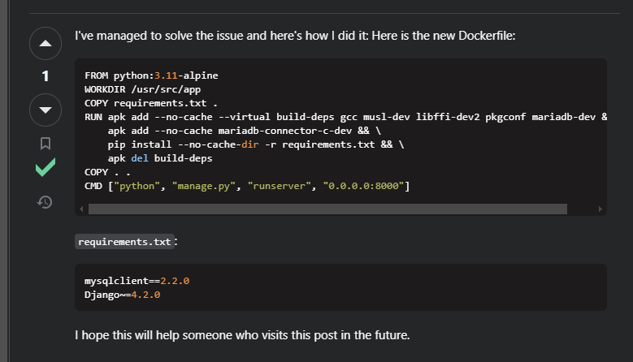
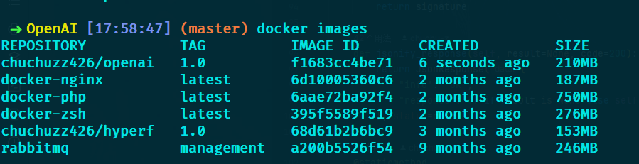

使用dockerfile构建一个Python环境的容器, 但是构建出来的镜像太大了, 可以优化一下。

<!--more-->


## 原Dockerfile

```dockerfile
FROM python:3.12

WORKDIR /app

COPY . /app

# pip 安装 Python 依赖后, 使用 sed 注释 /usr/local/lib/python3.12/site-packages/django/db/backends/base/base.py 的 225行, 避免检查mysql版本
RUN apt-get update && \
    apt-get install -y sed && \
    pip install --no-cache-dir -r requirements.txt && \
    sed -i '225s/^/#/' /usr/local/lib/python3.12/site-packages/django/db/backends/base/base.py

EXPOSE 9527

CMD ["python", "manage.py", "runserver", "0.0.0.0:9527"]
```

镜像大小: 1.35GB




## 优化1-多阶段构建

```dockerfile
# 阶段1
FROM python:3.12 AS builder

WORKDIR /app

COPY . /app

# 创建并激活虚拟环境
RUN python -m venv /venv && \
	# 使用 pip 安装 Python 依赖
	/venv/bin/pip install --no-cache-dir -r requirements.txt && \
	# 更新 apt-get
	apt-get update && \
	# 安装 sed
    apt-get install -y sed && \
    # 使用 sed 注释 /venv/lib/python3.12/site-packages/django/db/backends/base/base.py 的 225行，避免检查mysql版本
    sed -i '225s/^/#/' /venv/lib/python3.12/site-packages/django/db/backends/base/base.py

# 阶段2
FROM python:3.12

WORKDIR /app

COPY --from=builder /venv /venv
COPY --from=builder /app /app

# 设置环境变量
ENV PATH="/venv/bin:$PATH"

EXPOSE 9527

CMD ["python", "manage.py", "runserver", "0.0.0.0:9527"]
```

镜像大小: 1.17GB




## 优化2-使用Alpine基础镜像

使用Alpine Linux 时, 由于缺少完整的扩展包依赖, 然后又遇到了安装 mysqlclient 时错误的问题, 折腾好久, 功夫不负有心人, 在 [Stack Overflow](https://stackoverflow.com/questions/76533384/docker-alpine-build-fails-on-mysqlclient-installation-with-error-exception-can) 找到了一个可参考的, 然后稍作修改



```dockerfile
FROM python:3.12-alpine

WORKDIR /app

COPY requirements.txt .

# 更新 Alpine Linux 软件包索引
RUN apk update && \
    # 安装构建依赖和 MariaDB 开发依赖
    apk add --no-cache --virtual build-deps gcc musl-dev libffi-dev pkgconf mariadb-dev && \
    # 安装 mariadb-connector-c-dev 依赖
    apk add --no-cache mariadb-connector-c-dev && \
    # 使用 pip 安装 Python 依赖
    pip install --no-cache-dir -r requirements.txt && \
    # 使用 sed 注释 /usr/local/lib/python3.12/site-packages/django/db/backends/base/base.py 的 225行，避免检查mysql版本
    sed -i '225s/^/#/' /usr/local/lib/python3.12/site-packages/django/db/backends/base/base.py && \
    # 删除构建依赖，减小镜像体积
    apk del build-deps

COPY . .

EXPOSE 9527

CMD ["python", "manage.py", "runserver", "0.0.0.0:9527"]
```

此时再看镜像大小, 已经来到了210MB




## 优化3-使用Alpine基础镜像+多阶段构建

虽然210MB已经达到我的预期标准了, 但是我还想试试alpine+多阶段构建后有多大, 但是在分阶段这里总是遇到一些问题, 多次尝试还是未能攻克, 但是这个想法还是保留下来, 后期对docker构建流程更为精进再回来重新尝试。
