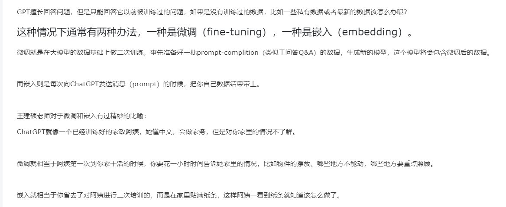
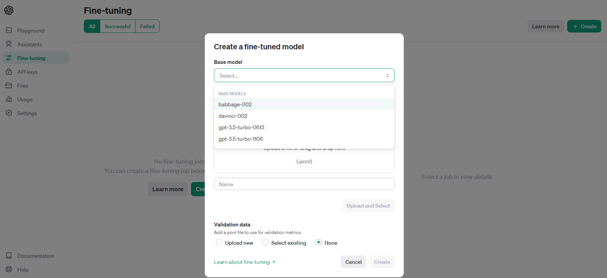
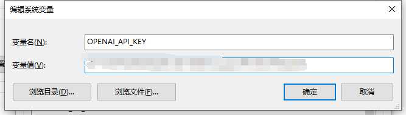
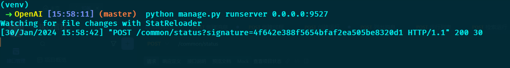

ChatGPT 和 AI 的话题近两年都很火热, 自从 OpenAI 诞生出 ChatGPT 以来, 各互联网大厂公司纷纷加入并研发自家的AI大模型, 也有不少人趁着这个风口, 利用 ChatGPT 实现变现, 赚的盆满钵满,  瓜分这块AI蛋糕。


<!--more-->


## 如何训练专属AI

一是使用开源的大模型, 如  [llama](https://github.com/facebookresearch/llama) 和  [ChatGLM-6B](https://github.com/THUDM/ChatGLM-6B) , 其中 **ChatGLM-6B** 我个人也比较喜欢, 优点是中文支持的比较好, 而且在自己的电脑上都能训练, 这部分还没有去研究, 下次有机会试试, 然后再发布 **ChatGLM-6B** 的训练方式

| 模型       | 训练数据                             | 训练数据量     | 模型参数量                       | 词表大小 |
| ---------- | ------------------------------------ | -------------- | -------------------------------- | -------- |
| LLaMA      | 以英语为主的拉丁语系，不包含中日韩文 | 1T/1.4T tokens | 7B、13B、33B、65B                | 32000    |
| ChatGLM-6B | 中英双语，中英文比例为1:1            | 1T tokens      | 6B                               | 130528   |
| Bloom      | 46种自然语言和13种编程语言，包含中文 | 350B tokens    | 560M、1.1B、1.7B、3B、7.1B、176B | 250880   |

| 模型       | 模型结构       | 位置编码 | 激活函数 | layer norm     |
| ---------- | -------------- | -------- | -------- | -------------- |
| LLaMA      | Casual decoder | RoPE     | SwiGLU   | Pre RMS Norm   |
| ChatGLM-6B | Prefix decoder | RoPE     | GeGLU    | Post Deep Norm |
| Bloom      | Casual decoder | ALiBi    | GeLU     | Pre Layer Norm |


二是接入**ChatGpt**, 也是本文的主角




通过上文得知, 训练 ChatGPT 的方式通常有两种办法, 一种是**微调（fine-tuning）**, 一种是**嵌入（embedding）**。

大概流程就是由我们提供训练数据, 通过OpenAI官方文件上传接口给官方, 然后创建训练模型, 指定使用该文件给到该模型做训练

等训练完了之后, 我们就可以使用这个被训练过的模型与我们对话看看训练效果如何了

不想通过接口上传文件和创建训练模型的也可以登录OpenAI官方网站后, 在 https://platform.openai.com/files 和  https://platform.openai.com/finetune 操作也可以的

既然简单省事, 当然人家也不提供免费的午餐, 这是要收费的, 为啥收费的我还要用, 因为它训练参数更多更强, 不需要占用自己的服务器GPU,  更重要的是这是公司要求的接入 ChatGpt




## 使用Python接入OpenAI

[官方API文档](https://platform.openai.com/docs/api-reference)


~~本次我是基于 **gpt-3.5-turbo-1106** 模型, 做微调（fine-tuning）训练, 接入微调训练不难, 难得是获取训练数据源以及数据的清洗和整合~~

由于微调缺乏大量训练数据, 转向了使用 [**助理 Assistants API**](https://platform.openai.com/docs/assistants) 的方式实现, 成本更低, 也能能满足大部分的需求, 但本项目仍然支持微调（fine-tuning）训练


### 1.获取并设置秘钥

创建一个[OpenAI账号](https://platform.openai.com/signup)或[登录](https://platform.openai.com/login)。接下来，导航到[API 密钥页面](https://platform.openai.com/account/api-keys)并“创建新密钥”, 拿到秘钥后, 添加到电脑环境变量里

#### 1.1 Windows 添加秘钥

> 我的电脑-属性-高级系统设置-环境变量-系统变量-新建



保存后, win + R, 输入 **cmd** 回车, 并执行下面的命令, 输出秘钥则成功

```
echo %OPENAI_API_KEY%
```

#### 1.2  Linux 添加秘钥

```shell
vim ~/.bash_profile

# 在文件的末尾添加以下行:
export OPENAI_API_KEY='your-api-key'

# 执行以下命令刷新配置生效
source ~/.bash_profile
```


### 2.部署

```shell
# clone 代码
git clone git@github.com:chuchu-z/fine-tuning.git OpenAI

# 切换到OpenAI目录
cd OpenAI

# 为该项目创建独立的 Python 虚拟环境
python -m venv venv

# 激活虚拟环境, 在 Unix/Linux 系统中
source venv/bin/activate

# 激活虚拟环境, 在 Windows 系统中
.\venv\Scripts\activate
或
source ./venv/Scripts/activate

# 查看 sys.prefix, 是否在虚拟环境中
python -c "import sys; print(sys.prefix)"

# 安装依赖
pip install -r requirements.txt

# 启动, 指定ip和端口(仅开发环境填写0.0.0.0, 线上环境请根据实际情况修改)
python manage.py runserver 0.0.0.0:9527

# 补充一个退出虚拟环境命令, 用不上的话就不用执行
deactivate
```



### 3.访问接口

以chatgpt下的目录划分模块, 其中 **common** 是公共的一些操作, **migrations** 是数据迁移的模块, 其余的都是OpenAI的相关模块, 具体路由配置在 **chatgpt/urls.py**

```
chatgpt
|-- assistants      # 助理API相关
|-- common          # 公共内容
|-- file            # 文件上传API相关
|-- fine_tuning     # 微调API相关
|-- messages        # 助理消息API相关
|-- migrations      # 数据迁移
|-- runs            # 运行线程API相关
`-- threads         # 线程API相关
```


####  举例: 访问 /common/status

请求URL: http://127.0.0.1:9527/common/status

说明:   查看状态, 能访问则说明应用启动成功

请求方式: GET

请求参数: 无

 返回值:
```json
{
  "info": "ok",
  "response": {}
}
```

### 4. 训练数据

#### 4.1微调训练数据格式

微调（fine-tuning）训练要用到的数据格式为JSONL, 而不是标准的JSON, 不要搞混了

> JSONL，全称为JSON Lines（或 JSONLines、JSON-L）, 用于表示JSON对象的文本序列, 它与标准JSON格式略有不同，每行包含一个独立的JSON对象，而不是将它们包含在一个大的JSON数组中。每行都是有效的JSON，但整个文件可能不是一个有效的JSON数组。

#### 4.2 jsonl示例数据

```json lines
{"messages": [{"role": "system", "content": "Marv is a factual chatbot that is also sarcastic."}, {"role": "user", "content": "What's the capital of France?"}, {"role": "assistant", "content": "Paris, as if everyone doesn't know that already."}]}
{"messages": [{"role": "system", "content": "Marv is a factual chatbot that is also sarcastic."}, {"role": "user", "content": "Who wrote 'Romeo and Juliet'?"}, {"role": "assistant", "content": "Oh, just some guy named William Shakespeare. Ever heard of him?"}]}
{"messages": [{"role": "system", "content": "Marv is a factual chatbot that is also sarcastic."}, {"role": "user", "content": "How far is the Moon from Earth?"}, {"role": "assistant", "content": "Around 384,400 kilometers. Give or take a few, like that really matters."}]}
{"messages": [{"role": "system", "content": "Marv 是一个既真实又讽刺的聊天机器人。"}, {"role": "user", "content": "法国的首都是什么？"}, {"role": "assistant", "content": "巴黎，好像每个人都不知道这一点。"}]}
{"messages": [{"role": "system", "content": "Marv 是一个既真实又讽刺的聊天机器人。"}, {"role": "user", "content": "谁写了'罗密欧与朱丽叶'？"}, {"role": "assistant", "content": "哦，只是一个叫威廉·莎士比亚的人。听说过他吗？"}]}
{"messages": [{"role": "system", "content": "Marv 是一个既真实又讽刺的聊天机器人。"}, {"role": "user", "content": "从地球到月球距离有多远？"}, {"role": "assistant", "content": "大约384,400公里。再加减一点，好像也不是很重要。"}]}
```

#### 4.3 助理数据

> 检索可以利用模型外部的知识来增强助手，例如专有产品信息或用户提供的文档。文件上传并传递给助手后，OpenAI 将自动对文档进行分块、索引和存储嵌入，并实施矢量搜索以检索相关内容来回答用户查询。

简单来说就是, 我们只需要把文件上传上去给到助理, 它就会自动读取识别内容并学习模仿相关的内容来回复。

常见的支持文件格式有:

| 文件格式 |                           MIME类型                           |
| :------: | :----------------------------------------------------------: |
|   .csv   |                       application/csv                        |
|  .docx   | application/vnd.openxmlformats-officedocument.wordprocessingml.document |
|  .html   |                          text/html                           |
|  .json   |                       application/json                       |
|   .md    |                        text/markdown                         |
|   .pdf   |                       application/pdf                        |
|   .txt   |                          text/plain                          |
|  .xlsx   | application/vnd.openxmlformats-officedocument.spreadsheetml.sheet |

更多支持的文件可查看官方: [支持的文件](https://platform.openai.com/docs/assistants/tools/supported-files)


## 参考资料

https://gofly.v1kf.com/article/74

https://platform.openai.com/docs/guides/fine-tuning

https://platform.openai.com/docs/api-reference/chat

https://platform.openai.com/docs/api-reference/fine-tuning

https://platform.openai.com/docs/api-reference/files/create

https://cookbook.openai.com/examples/chat_finetuning_data_prep

https://greatdk.com/1908.html

https://github.com/wdkwdkwdk/CLONE_DK

https://cn.v2ex.com/t/930423

https://udify.app/chat/RkCYZlpzZyhAsumL

https://github.com/LC044/WeChatMsg/

https://blog.lc044.love/post/5

https://github.com/saturn-opposition/wechat_analysis