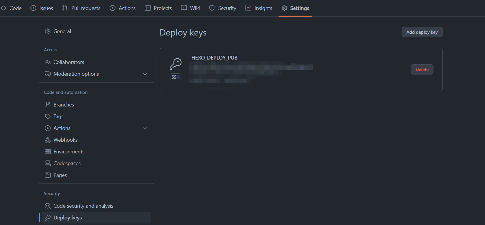
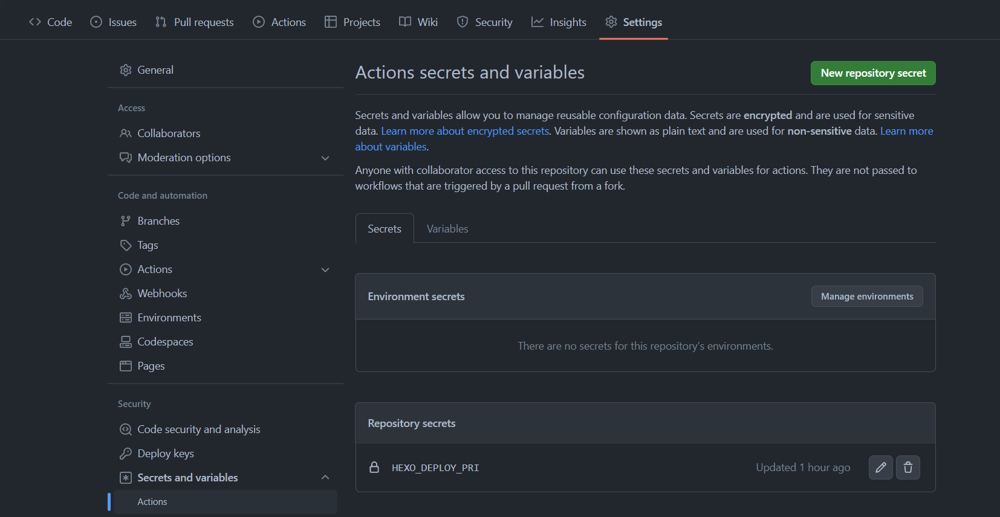

# Github+Actions实现Hexo自动化部署


## 前言

>由于半夜睡不着，突然想到博客很久没有更新了， 准备把很久之前写好的文章发布一下，但是发现原来使用的 **travis-ci** 没有触发， 去查了一下才知道 [Travis CI 在 2020年 11 月 2 日就改变了收费策略](https://blog.travis-ci.com/2020-11-02-travis-ci-new-billing) ，原来我现在用的免费方案，系统会赠送 10000 积分（一次性）。Linux 机器上每分钟消耗 10 积分，macOS 机器上每分钟消耗 50 积分，我的积分已经消耗完了。一开始我觉得比较诧异，因为我以前从来没关注有这个积分机制，以为公共仓库使用 Travis CI 服务都是免费的。被迫无奈，本来只是想发个文章，变成了连夜更换CI/CD，中途还发现域名快到期了顺便续了一年😥。


## Hexo 持续集成

由于本人是通过**Github Pages**方式来实现博客托管的，好处是不需要自己购买服务器和域名， 只需要在github上创建一个repository，这个repository的名字还有要求必须是**username.github.io**，再随便写个静态html内容上传就可以直接访问了，具体方法这里不再多说。

先简单介绍一下项目仓库，源代码和hexo编译后的静态资源都在同一仓库（**chuchu-z.github.io**）， 只是分支不同，src分支为源代码仓库， master分支为hexo编译后的静态资源， 也就是博客展示出来的内容。


### 生成公钥私钥

```
ssh-keygen -t rsa  -C "$(git config user.name)" -f github-deploy-key
```


### 添加仓库环境变量

设置 HEXO_DEPLOY_PUB，value 是上步生成的 github-deploy-key.pub 文件内容。



设置 HEXO_DEPLOY_PRI，value 是上步生成的 github-deploy-key 文件内容。




### 编写配置文件deploy.yml

在 `myblog` 项目根目录下创建 `.github/workflows/deploy.yml` 文件。

```yml
# Action 的名字
name: Hexo Auto Deploy

on:
  # 触发条件1：src 分支收到 push 后执行任务。
  push:
    branches:
      - src
  # 触发条件2：手动按钮
  workflow_dispatch:

# 这里放环境变量,需要替换成你自己的
env:
  # Hexo 编译后使用此 git 用户部署到 github 仓库
  GIT_USER: chuchu-z
  # Hexo 编译后使用此 git 邮箱部署到 github 仓库
  GIT_EMAIL: 1813713320@qq.com
  # Hexo 编译后要部署的 github 仓库
  GIT_DEPLOY_REPO: chuchu-z/chuchu-z.github.io
  # Hexo 编译后要部署到的分支
  GIT_DEPLOY_BRANCH: master

jobs:
  build:
    name: Build on node ${{ matrix.node_version }} and ${{ matrix.os }}
    # 配置运行的机器环境
    runs-on: ubuntu-latest
    if: github.event.repository.owner.id == github.event.sender.id
    strategy:
      matrix:
        os: [ubuntu-latest]
        node_version: [14]

	# 执行步骤
    steps:
      - name: Checkout
        uses: actions/checkout@v2

      - name: Checkout deploy repo
        uses: actions/checkout@v2
        with:
          repository: ${{ env.GIT_DEPLOY_REPO }}
          ref: ${{ env.GIT_DEPLOY_BRANCH }}
          path: .deploy_git

      - name: Use Node.js ${{ matrix.node_version }}
        uses: actions/setup-node@v1
        with:
          node-version: ${{ matrix.node_version }}

		# 授权密钥
      - name: Configuration environment
        env:
          HEXO_DEPLOY_PRI: ${{secrets.HEXO_DEPLOY_PRI}}
        run: |
          sudo timedatectl set-timezone "Asia/Shanghai"
          mkdir -p ~/.ssh/
          echo "$HEXO_DEPLOY_PRI" > ~/.ssh/id_rsa
          chmod 600 ~/.ssh/id_rsa
          ssh-keyscan -t rsa github.com >> ~/.ssh/known_hosts
          # coding 已取消同步
          ssh-keyscan -t rsa e.coding.net >> ~/.ssh/known_hosts
          ssh-keyscan -t rsa gitee.com >> ~/.ssh/known_hosts
          git config --global user.name $GIT_USER
          git config --global user.email $GIT_EMAIL

		# 安装并执行hexo
      - name: Install dependencies
        run: |
          npm install -g hexo-cli --no-fund
          npm install -g --no-fund
          hexo clean
          hexo generate

      - name: Deploy hexo
        run: |
          npm run deploy


```


把配置文件提交到github仓库之后， 只要src（源代码）分支触发push操作，就会自动触发部署，在Actions就可以看到具体部署情况。


### 总结

在学习了网上其他大佬们的方法后自己稍微做了些修改，也是总算成功完成了，感觉这次处理起来比上次使用travis-ci简单快的多，也可能是之前踩过不少坑了，这次比较顺利，早知道github+actions这么方便就不用travis-ci了， 不过要不是travis-ci收费了我现在也还不知道github+actions也挺好用，刚好天亮了睡觉😴。
