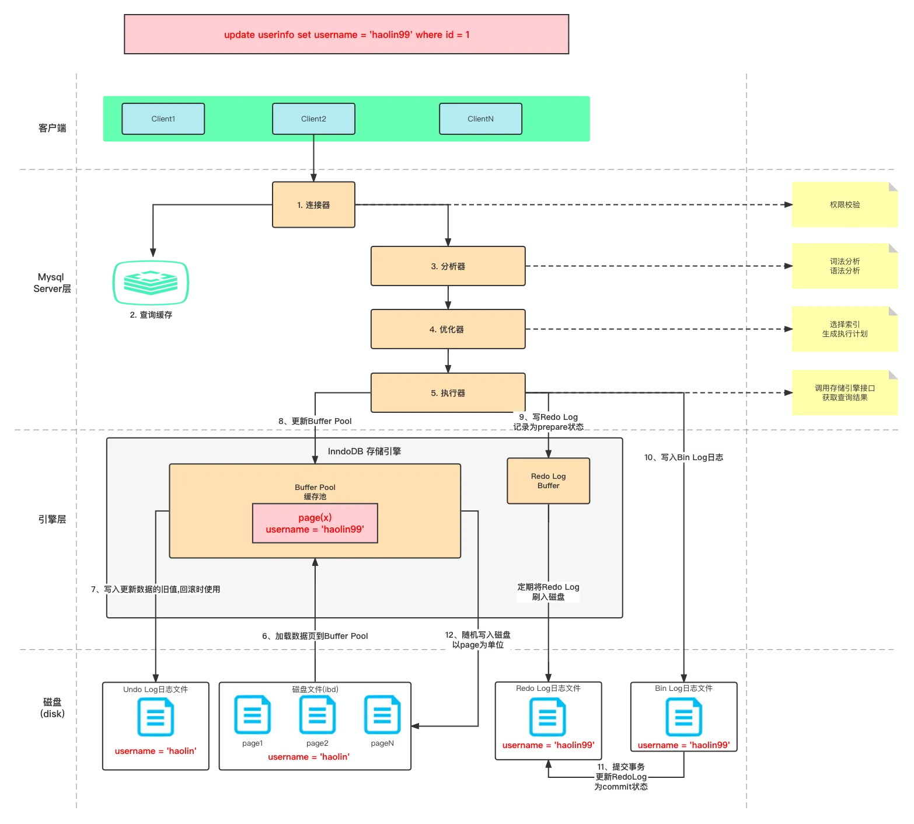
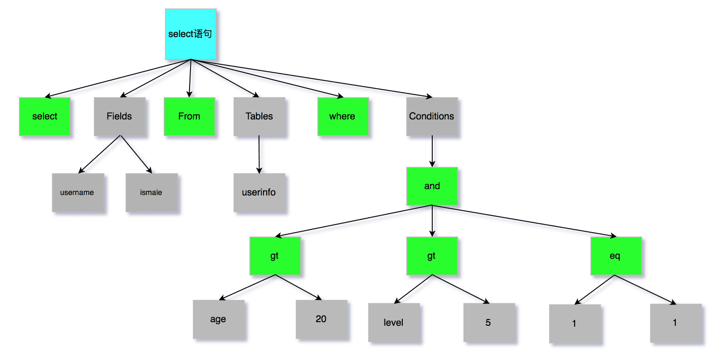

## MySQL执行流程

> 连接器-查询缓存(如果是select才查询缓存, MySQL8.0废弃)-解析器(词法分析, 语法分析)-预处理器(判断表/字段是否存在)-优化器-执行器(验证权限, 调用存储引擎API, 如果有索引下推则携带索引条件给存储引擎判断-存储引擎查询数据并利用索引下推过滤数据, 然后执行回表查询数据, 向执行器(server层)返回结果)

<!--more-->

## 分析器

## varchar字段最大取值计算公式

> 65535 - 变长字段字节数列表所占用的字节数 - NULL值列表所占用的字节数 = 65535 - 2 - 1 = 65532
>
> 如果有多个字段的话，要保证所有字段的长度 + 变长字段字节数列表所占用的字节数 + NULL值列表所占用的字节数 <= 65535

## InnoDB 行格式及数据溢出处理方式

| 行格式     | 适用场景                            | 存储空白列 | 行头大小 | 溢出处理                                                     |
| ---------- | ----------------------------------- | ---------- | -------- | ------------------------------------------------------------ |
| Compact    | 适用于索引列，OLAP 场景             | 不存储     | 固定     | 部分真实数据存储在数据页，溢出数据存储在溢出页中，通过指针连接溢出页 |
| Dynamic    | 适用于非索引列，OLTP 场景           | 存储       | 可变     | 完全的行溢出方式，记录的真实数据处不存储该列的一部分数据，只存储 20 个字节的指针来指向溢出页 |
| Compressed | 适用于需要压缩存储的场景，Barracuda | 存储       | 可变     | 完全的行溢出方式，记录的真实数据处不存储该列的一部分数据，只存储 20 个字节的指针来指向溢出页 |

在 `Compressed` 行格式中，如果数据行的大小超过了页的大小，InnoDB 存储引擎会使用分页压缩算法来减小数据的存储空间，但这并不是通过将溢出的数据存储在溢出页中来实现的。

