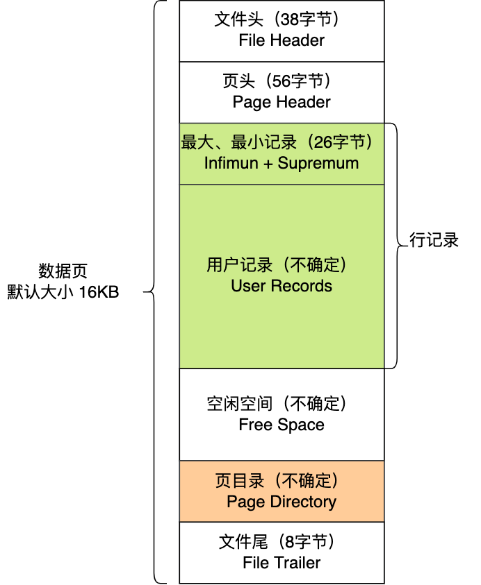

## 索引与引擎及其关系

### 索引

> 一种提高查询性能的数据结构, 类似于一本字典中的目录, 使得可以快速定位和检索数据位置, 具有以空间换时间的设计思想,
>
> 所以并不是任何情况都适合创建索引, 索引的价值是快速定位，如果起不到定位的字段通常是不需要创建索引的，因为索引会占用物理空间,
>
> 另外, 经常更新且不需要用作where条件的字段不必要创建索引, 数据频繁修改, 动态维护索引也需要额外的开销将影响数据库性能。

<!--more-->

### 存储引擎

> 解决如何存储数据, 如何为存储的数据建立索引以及如何更新、查询数据等技术。
>
> MySQL 存储引擎有 MyISAM 、InnoDB、Memory等, 其中 InnoDB 是在 MySQL 5.5 之后成为默认的存储引擎。

### 关系

> 存储引擎决定表的物理存储结构, 包括: 数据文件的格式、索引文件的格式, 包括如何组织数据、如何处理索引、如何处理事务、如何处理并发等。
>
> 而索引则是在这个物理存储结构上建立的数据结构, 不同的存储引擎可以支持不同类型的索引，例如B+树索引、B树索引、HASH索引。

## InnoDB

> InnoDB数据按[数据页]为单位进行读写
>
> InnoDB数据页默认大小为16KB, 所以InnoDB每次I/O操作数据最少操作16KB数据
>

## 索引划分

|     分类     |       索引类型       |                            特点                             |                             说明                             |
| :----------: | :------------------: | :---------------------------------------------------------: | :----------------------------------------------------------: |
| 数据结构分类 |     B+Tree 索引      |                 适用于等值查询和范围查询。                  | B+Tree 索引是一种平衡树结构，适用于范围查询和排序，是 MySQL 默认的索引类型。 |
|              |      HASH 索引       | 适用于等值查询，不支持范围查询，对于大数据量的表性能较好。  | HASH 索引适用于等值查询，通过散列算法将索引列的值映射为散列值，对于大型数据集可以提供快速的查找。 |
|              |    Full-Text 索引    |      用于全文搜索，支持对文本数据进行高效的模糊查询。       | Full-Text 索引是为了支持全文搜索，可以在文本数据中执行模糊查询，适用于需要搜索关键词的场景。 |
| 物理存储分类 | 聚簇索引（主键索引） | 数据行的物理顺序与索引的顺序一致，InnoDB 存储引擎默认使用。 | 聚簇索引决定了数据在磁盘上的物理存储顺序，通常是主键索引。在 InnoDB 存储引擎中，表的数据行实际上是按照主键顺序存储的。 |
|              | 二级索引（辅助索引） |     非主键索引，存储实际数据行的引用而不是实际的数据。      | 二级索引是不基于表的物理存储顺序的索引，而是存储指向实际数据行的引用。 |
| 字段特性分类 |       单列索引       |                  仅基于单个列创建的索引。                   | 单列索引是最基本的索引类型，没有唯一性或其他特殊约束，可以包含重复的值。 |
|              | 联合索引（复合索引） |     基于多个列创建的索引，适用于同时查询多个列的情况。      |      联合索引可以包含多个列，有助于优化多列的查询条件。      |
|              |       唯一索引       |     确保索引列的值唯一，可用于强制实施表的唯一性约束。      | 唯一索引确保索引列中的值是唯一的，可用于强制表中的数据唯一性。 |
|              |       普通索引       |       基本索引类型，没有特殊约束，可以包含重复的值。        | 普通索引是最基本的索引类型，没有唯一性或其他特殊约束，可以包含重复的值。 |
|              |       前缀索引       |       仅对列的前几个字符创建索引，可减小索引的大小。        | 前缀索引是指对列的前几个字符创建的索引，用于减小索引的存储空间。 |

## 索引优化
