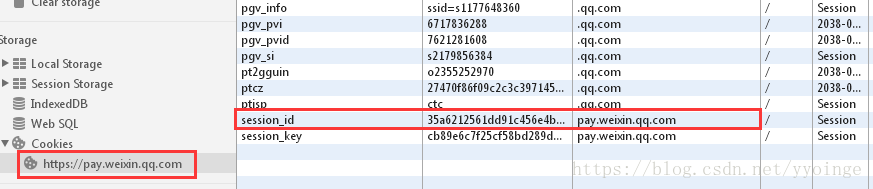
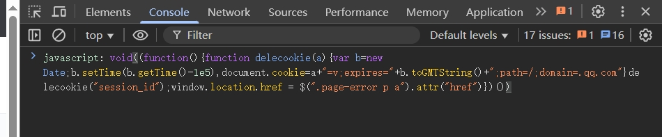

## bug原因

> 微信支付推出了服务商朋友圈广告功能，服务商发布朋友圈广告时，需要为广告文案指定门店，而只有在腾讯地图上标注过的门店才能在服务商平台上被添加并选择，于是很多服务商会在登录服务商平台的同时，登录腾讯地图的商户标注页面进行门店信息批量标注。此时微信支付服务商平台还是可以正常使用的，但是一旦主动退出或会话超时自动退出服务商平台后，再去登录服务商平台就会出现无法登录的bug了。当然，如果你启动浏览器后，先访问腾讯地图的商户标注页面，再登录[微信支付服务商平台](https://pay.weixin.qq.com/)，那么同样会出现无法登录的bug。


## 为什么这样操作会导致bug的产生

跟服务商平台网页cookies（缓存）有关。如果只登录服务商平台，这个时候平台页面对应的cookies中，只有一个Name（名称）为 **session_id** 的cookies，该cookies的domain（域）为 **pay.weixin.qq.com** 。



但是一旦访问过腾讯地图的商户标注页面，那么服务商平台页面对应的cookies中，就有2个Name为 **session_id** 的cookies，多了一个domain为 **.qq.com** 的。

 正是这个cookies在作祟，才导致服务商平台登录不了。


## 解决方式

在显示登录失败页面按F12打开控制台, 在 **Console** 栏下粘贴以下代码, 回车解决。

```js
javascript: void((function(){function delecookie(a){var b=new Date;b.setTime(b.getTime()-1e5),document.cookie=a+"=v;expires="+b.toGMTString()+";path=/;domain=.qq.com"}delecookie("session_id");window.location.href = $(".page-error p a").attr("href")})())
```




参考链接: [微信支付服务商平台（商户平台）扫码登录后提示“登录超时，请重新登录”时该怎么处理？](https://blog.csdn.net/yyoinge/article/details/80910676)

CSDN的登录弹窗和广告太烦人了, 还不能一键复制, 加上 **Tampermonkey** 脚本都失效了, 实在没办法才搬运自己备用


## END

另外, 很久没更新文章了, 愣是被这个问题逼得我水一篇文章

既然更新了, 就汇报一下最近的状况:  最近很忙很充实, 晚上会夜跑, 有人陪我一起跑🐾。

最后, 留下一串神秘代码💥

```bash
F**k U WX
```

