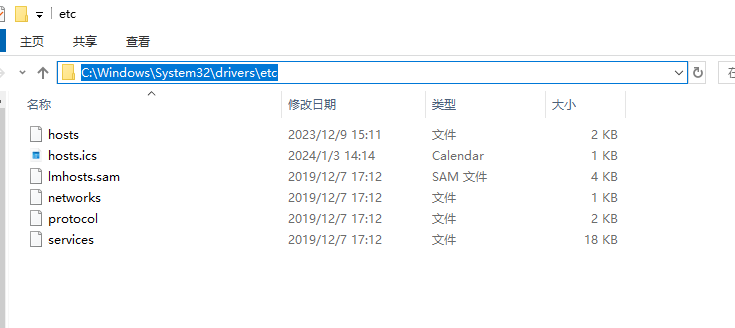

因为谷歌关闭了中国大陆的谷歌翻译服务, 谷歌翻译扩展也停用了, 尽管我也想少用翻译软件, 多尝试自己阅读原文文档, 但不等于直接用不了一点啊啊啊


<!--more-->


## 解决方案

### 1. 修改hosts文件

Win + E, 地址栏直接输入 **C:\Windows\System32\drivers\etc** 回车




编辑hosts文件,  从下面现用和备用中选一个加到文件最后

```tex
# 现用
203.208.40.66 translate.google.com
203.208.40.66 translate.googleapis.com

# 如果上面的失效了, 可试试这个备用的
120.253.253.34 translate.googleapis.com
142.250.0.90 translate.googleapis.com
```


### 2. 刷新DNS

然后 Win + R, 输入 **cmd** 回车, 执行下面的命令, 刷新DNS, 搞定!

```bash
ipconfig /flushdns
```

